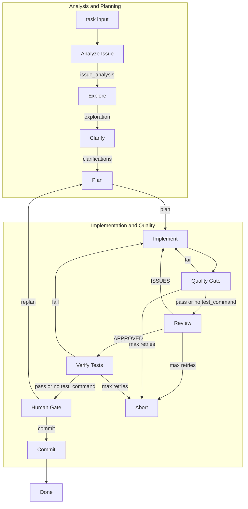

# code_pipeline

A software development crew powered by [crewAI](https://crewai.com). The pipeline explores a codebase, clarifies ambiguities with the human, plans changes, implements them, reviews the work, and commits—exclusively for software development tasks.

## Installation

**Requirements:** Python >=3.10, <3.13

1. Install [uv](https://docs.astral.sh/uv/):

```bash
pip install uv
```

2. Clone this repository and install dependencies:

```bash
cd code_pipeline  # or your project directory
uv sync
```

Or use the crewAI CLI:

```bash
crewai install
```

3. Create a `.env` file in the project root and add your API key:

```
# OpenRouter (DeepSeek) - used by default
OPENROUTER_API_KEY=your_key_here

# Or use OpenAI
OPENAI_API_KEY=your_key_here
```

The pipeline uses OpenRouter with **Gemini 3 Flash** as the primary model for most stages (see [Default Model and Rationale](#default-model-and-rationale)). Set `OPENROUTER_API_KEY` for OpenRouter models, or `OPENAI_API_KEY` as fallback.

### Optional: GitHub and Documentation Tools

- **GITHUB_TOKEN** — Required for GithubSearchTool (semantic search in GitHub repos). Set in `.env` or environment. Used when `--github-repo` is provided.
- **--github-repo** — GitHub repo in `owner/repo` format. Enables GithubSearchTool for Analyze and Plan stages to find similar implementations and issues.
- **--docs-url** — Documentation URL for CodeDocsSearchTool (e.g. `https://docs.djangoproject.com`). Enables framework-specific doc search in Explore, Plan, and Review.
- **--issue-url** — URL of the issue when the task references a web-based tracker (Jira, Linear, GitHub). Enables ScrapeWebsiteTool in Analyze to fetch full issue content.

### CodeInterpreterTool (Implement stage)

The Implement stage can use CodeInterpreterTool for running Python code snippets when **Docker** is available. If Docker is not installed or not running, the tool is skipped and the pipeline continues with other tools (FileWriterTool, RepoShellTool).

See [docs/TOOLS_REFERENCE.md](docs/TOOLS_REFERENCE.md) for tool parameters and example commands.

## How to Use

- **Option 1: Task** — `task run` (recommended; uses config.yaml by default)
- **Option 2: CLI** — `uv run kickoff -c config.yaml`
- **Option 3: Docker** — `docker run -it --rm -v $(pwd):/workspace -w /workspace -e OPENROUTER_API_KEY=... iklobato/mycrew -c config.yaml`

### Option 1: Task commands (recommended)

If you have [Task](https://taskfile.dev/) installed, use the Taskfile.

**Available tasks:** `task run` | `task run-script` | `task run:from-scratch` | `task run:dry` | `task plot` | `task help`

- **`task run`** — Default: runs from scratch using `config.yaml`. Copy `config.example.yaml` to `config.yaml` and edit. Prints full config before running.
- **`task run-script`** — Pass kickoff flags after `--` (e.g. `task run-script -- -c config.yaml -v -f`)
- **`task run:from-scratch`** — Same as `task run` (from scratch is already the default)
- **`task run:dry`** — Dry run mode (no git commit)
- **`task plot`** — Plot the flow diagram
- **`task help`** — Show kickoff CLI help

Pass parameters via Task vars: `R=`, `V=1`, `TASK_DESC=`, etc.

**Parameters (same semantics as kickoff flags):**

| Param | Maps to | Default |
|-------|---------|---------|
| `CONFIG` | `-c` / `--config` | `config.yaml` (default) |
| `TASK_DESC` | `-t` / `--task` | (from config or required if no CONFIG) |
| `R` | `-r` / `--repo-path` | `.` (or from config) |
| `B` | `-b` / `--branch` | `main` |
| `V` | `-v` / `--verbose` | `0` |
| `F` | `-f` / `--from-scratch` | `1` (default: from scratch) |
| `N` | `-n` / `--retries` | `3` |
| `DRY_RUN` | `--dry-run` | `0` |
| `TEST` | `--test-command` | — |
| `ISSUE_ID` | `--issue-id` | — |
| `GITHUB_REPO` | `--github-repo` | — |
| `ISSUE_URL` | `--issue-url` | — |
| `DOCS` | `--docs-url` | — |

**Task usage examples:**

```bash
# Default: from scratch + config.yaml
# 1. Copy template: cp config.example.yaml config.yaml
# 2. Edit config.yaml with your task, repo_path, etc.
# 3. Run: task run
task run

# Different config file
task run CONFIG=REMOVED

# Override task from config (TASK_DESC overrides config's task)
task run TASK_DESC="add a hello world function"

# With repo and verbose
task run TASK_DESC="fix login bug" R=/path/to/repo V=1

# Repo and branch
task run TASK_DESC="fix bug" R=./my-app B=dev

# Dry run (no git commit)
task run TASK_DESC="add user authentication" DRY_RUN=1
task run:dry TASK_DESC="add user authentication"

# Resume from checkpoint (override default from-scratch)
task run CONFIG=config.yaml F=0

# CLI args style (pass kickoff flags after --)
task run-script -- -c config.yaml -v -f
task run-script -- -t "add feature" -r . --dry-run

# Full example: all params
task run TASK_DESC="add validation logic" \
  R=./my-app \
  B=main \
  N=5 \
  TEST="pytest" \
  ISSUE_ID="fixes #42" \
  GITHUB_REPO="owner/repo" \
  ISSUE_URL="https://github.com/owner/repo/issues/42" \
  DOCS="https://docs.djangoproject.com" \
  V=1
```

### Option 2: Direct CLI

Run the pipeline with `uv run kickoff`. Use `-c config.yaml` to load all params from YAML, or pass `-t` and `-r` explicitly.

**Basic usage:**

```bash
# Config file (recommended)
uv run kickoff -c config.yaml

# Task and repo explicitly
uv run kickoff -t "add a hello world function" -r /path/to/your/repo
```

**All options:**

| Option | Short | Description | Default |
|--------|-------|-------------|---------|
| `--task` | `-t` | Task or issue card description (required) | — |
| `--repo-path` | `-r` | Path to the repository to modify | Current directory |
| `--branch` | `-b` | Git branch for commits | `main` |
| `--from-scratch` | `-f` | Ignore checkpoint and run from the beginning | `false` |
| `--retries` | `-n` | Max implement→review retries | `3` |
| `--dry-run` | — | Skip actual git commit; only report what would be committed | `false` |
| `--test-command` | — | Command for quality gate and verification (e.g. pytest, npm test) | — |
| `--issue-id` | — | Issue ID for commit message (e.g. fixes #42) | — |
| `--github-repo` | — | GitHub repo (owner/repo) for GithubSearchTool; requires GITHUB_TOKEN | — |
| `--issue-url` | — | URL of the issue for ScrapeWebsiteTool (e.g. GitHub, Jira) | — |
| `--docs-url` | — | Documentation URL for CodeDocsSearchTool (e.g. https://docs.djangoproject.com) | — |
| `--focus-paths` | — | Comma-separated paths to prioritize in exploration (e.g. src,lib) | — |
| `--exclude-paths` | — | Comma-separated paths to skip in exploration (e.g. node_modules,vendor) | — |
| `--config` | `-c` | Path to YAML config file (all params; CLI overrides) | — |

**CLI examples:**

```bash
# Config file (copy config.example.yaml to config.yaml and edit)
uv run kickoff -c config.yaml

# From scratch + verbose
uv run kickoff -c config.yaml -f -v

# Dry run
uv run kickoff -t "add user authentication" -r ./my-app --dry-run

# From scratch (ignore checkpoint)
uv run kickoff -t "add feature" -r ./my-app -f

# Full run with all optional params
uv run kickoff \
  -t "add validation logic" \
  -r ./my-app \
  -b main \
  -n 5 \
  --test-command "pytest" \
  --issue-id "fixes #42" \
  --github-repo "owner/repo" \
  --issue-url "https://github.com/owner/repo/issues/42" \
  --docs-url "https://docs.djangoproject.com"
```

### Option 3: Docker

Run the pipeline in a container. Requires Docker and API keys.

**Build (optional, if using pre-built image):**

```bash
docker build -t iklobato/mycrew .
```

**Basic run:**

```bash
docker run -it --rm \
  -v $(pwd):/workspace \
  -w /workspace \
  -e OPENROUTER_API_KEY=$OPENROUTER_API_KEY \
  iklobato/mycrew -c config.yaml
```

**Config requirements:** `repo_path` in config must be valid inside the container. Use `"."` (relative to `/workspace`) or `/workspace` or `/workspace/subdir`. Host paths like `/Users/you/...` will not work.

**Optional env vars:**
- `-e GITHUB_TOKEN=$GITHUB_TOKEN` — For GithubSearchTool when `--github-repo` is in config
- `-e OPENAI_API_KEY=$OPENAI_API_KEY` — Alternative to OpenRouter

**Optional:** If `.env` is in your workspace, it is included via the volume mount and will be loaded from `/workspace/.env`.

**Docker Compose:** For a simpler run with built-in mounts and env:

```bash
docker compose run --rm run
```

**Note:** CodeInterpreterTool requires Docker and is skipped when running inside a container.

## Default Model and Rationale

The pipeline uses **stage-specific models** defined in `src/code_pipeline/llm.py`. Each stage has a primary model and fallbacks; if the primary fails (e.g. rate limit, empty response), the next in sequence is tried.

| Stage        | Primary Model                    | Fallbacks                                   |
|-------------|-----------------------------------|---------------------------------------------|
| analyze_issue | Gemini 3 Flash                   | DeepSeek R1, GPT-5 Nano, Qwen3 Next 80B     |
| explore       | Gemini 3 Flash                   | DeepSeek R1, GPT-5 Nano, Kimi K2.5, Qwen3 Coder |
| plan          | Gemini 3 Flash                   | DeepSeek V3.2, DeepSeek R1, Qwen3 235B Thinking |
| implement     | Gemini 3 Flash                   | DeepSeek V3.2, Kimi K2.5, DeepSeek R1, Qwen3 Coder |
| review        | **DeepSeek V3.2**               | Gemini 3 Flash, DeepSeek R1, Qwen3 235B Thinking |
| commit        | Gemini 3 Flash                   | GPT-5 Nano, Trinity Mini, DeepSeek R1       |

**Clarify** uses the same model as `analyze_issue` (Gemini 3 Flash).

**Why Gemini 3 Flash for most stages:** Fast, cost-effective, and strong at structured output and tool use. Handles multi-tool workflows (ScrapeWebsite, RepoShell, GithubSearch, CodeDocsSearch) well. Preview models like gpt-5-nano and trinity-mini can return empty responses and are used only as fallbacks.

**Why DeepSeek V3.2 for Review:** Review is the critical gate before human approval. DeepSeek V3.2 is chosen for stricter, more conservative validation—catching overengineering, plan drift, and subtle bugs that faster models might miss. Fallbacks include Qwen3 235B Thinking for complex reasoning when needed.

**Human Gate:** Uses `gpt-4o-mini` (hardcoded) to interpret the human's short response (commit vs replan). Lightweight and cheap for this interactive step.

---

## Pipeline Overview



The flow runs multiple stages with quality gates:

1. **Analyze Issue** — Parses the task/issue card into structured requirements (summary, acceptance criteria, scope, technical hints). Uses similar issues and company moment when `github_repo` is set.
2. **Explore** — Scans the repository structure, tech stack, and conventions. Output focuses on areas relevant to the issue.
3. **Clarify** — Asks the human targeted questions to resolve ambiguities before planning. Produces Clarifications & Development Guidelines that override assumptions.
4. **Plan** — Designs the file-level implementation approach, mapped to acceptance criteria. No code—only paths and change descriptions.
5. **Implement** — Writes and applies code changes. Invokes RepoFileWriterTool for every file in the plan.
6. **Quality Gate** — If `--test-command` is set, runs tests; on failure, retries Implement.
7. **Review** — Validates the implementation. On rejection (ISSUES), loops back to Implement (up to `--retries`). On approval, proceeds to verification or human gate.
8. **Verification** — If `--test-command` is set and review approved, runs tests again; on failure, retries Implement.
9. **Human Gate** — Presents the result to the human. On "commit", runs Commit. On "replan", feeds feedback back to Plan.
10. **Commit** — Stages and commits the changes (skipped when `--dry-run` is set).

### Step Inputs and Outputs

| Step | Inputs | Outputs |
|------|--------|---------|
| **Analyze Issue** | `task`, `issue_url`, `github_repo`, `repo_path`, `docs_url`, `test_command`, `branch` | `issue_analysis` (summary, acceptance criteria, scope, technical hints) |
| **Explore** | `issue_analysis`, `repo_path`, `test_command`, `focus_paths`, `exclude_paths`, `github_repo` | `exploration` (tech stack, directory layout, key files, conventions) |
| **Clarify** | `task`, `issue_analysis`, `exploration` | `clarifications` (human answers via `ask_human`; authoritative guidelines for plan/implement) |
| **Plan** | `task`, `exploration`, `issue_analysis`, `prior_issues`, `clarifications`, `github_repo`, `docs_url`, `repo_path`, `test_command` | `plan` (file-level spec: Files to Create/Modify, no code) |
| **Implement** | `task`, `plan`, `prior_issues`, `clarifications`, `repo_path`, `issue_analysis` | `implementation` (text summary) + file writes via RepoFileWriterTool |
| **Quality Gate** | `repo_path`, `test_command` | `quality_gate_passed`, `quality_gate_output`; routes to review or retry |
| **Review** | `task`, `plan`, `implementation`, `repo_path`, `issue_analysis`, `docs_url` | `review_verdict` (`APPROVED` or `ISSUES:` + bullet list) |
| **Route Verdict** | `review_verdict`, `test_command` | Routes to `human_gate`, `retry`, or `pipeline_aborted` |
| **Verification** | `repo_path`, `test_command` | `verification_passed`, `verification_output`; routes to human_gate or retry |
| **Human Gate** | `task`, `review_verdict`, `implementation`, `plan` (presented to human) | Human reply: `commit` or `replan` |
| **Commit** | `repo_path`, `branch`, `feature_branch`, `dry_run`, `issue_id` | Git branch + commit (or dry-run report); optionally create PR |

### Crew Members: Responsibility, Context, and Tools

Each crew is a specialized agent with a clear role in the pipeline.

| Crew | Responsibility | Context | Tools | Importance |
|------|----------------|---------|-------|------------|
| **Issue Analyst** | Transforms raw task/issue URLs into structured requirements (Summary, Acceptance Criteria, Scope, Technical Hints). When `github_repo` is set, analyzes similar issues and company moment. Keeps criteria minimal, flags scope creep. | Runs first. Receives `task`, `issue_url`, `github_repo`. Output feeds every downstream crew. | ScrapeWebsiteTool, RepoShellTool (`gh`), GithubSearchTool, CodeDocsSearchTool | Foundation of the pipeline. Poor analysis leads to wrong plans and implementations. |
| **Explorer** | Scans repo and produces Tech Stack, Directory Layout, Key Files, Conventions. Focuses on issue-relevant areas. Read-only shell commands only. | Runs after Issue Analyst. Receives `issue_analysis`. Output feeds Clarify and Architect. Fallback on failure. | RepoShellTool, CodeDocsSearchTool | Architect and Implementer rely on accurate structure. Wrong exploration leads to plans touching wrong files. |
| **Clarify** | Resolves ambiguities before planning. Cross-references task, analysis, exploration for tensions (ownership, conventions, scope, tests, migrations). Asks human via `ask_human` with 2–4 options and code snippets per question. | Runs after Explorer, before Architect. Receives `task`, `issue_analysis`, `exploration`. Output is authoritative for Architect and Implementer. | ask_human only | Prevents Architect from guessing. Human answers become hard constraints that reduce rework. |
| **Architect** | Produces file-level plan without code. Maps to acceptance criteria. Respects Clarifications. Incorporates `prior_issues`. Minimum changes, prefer modifying over creating. Verifies paths before outputting. | Runs after Clarify (or `do_replan`). Receives `task`, `exploration`, `issue_analysis`, `clarifications`, `prior_issues`, `github_repo`, `docs_url`. Output consumed literally by Implementer. | RepoShellTool, GithubSearchTool, CodeDocsSearchTool | Plan is the contract. Wrong paths lead to wrong code. Must verify before outputting. |
| **Implementer** | Writes code via RepoFileWriterTool for each file in the plan. Reads before modifying. Runs tests, fixes failures. Follows Clarifications over plan when conflicted. Fixes all `prior_issues`. | Runs after Plan. Receives `task`, `plan`, `issue_analysis`, `clarifications`, `prior_issues`, `repo_path`. Must call FileWriter for every file. | RepoShellTool, RepoFileWriterTool, CodeInterpreterTool (optional) | Only crew that writes code. Surgical changes only. Skipping FileWriter or touching unplanned files leads to wrong implementations. |
| **Reviewer** | Validates against plan and acceptance criteria. Verifies all planned files created/modified. Rejects overengineering. Outputs exactly `APPROVED` or `ISSUES:` with bullet list. | Runs after Quality Gate. Receives `task`, `plan`, `implementation`, `issue_analysis`, `repo_path`, `docs_url`. Reads actual files before deciding. | RepoShellTool, CodeDocsSearchTool | Gatekeeper before human approval. Uses DeepSeek V3.2 for stricter validation. |
| **Commit** | Creates feature branch, stages, commits with Conventional Commits. Skips when `dry_run`. Excludes `.code_pipeline`. Includes `fixes #X` when `issue_id` set. No destructive commands. | Runs after human approval. Receives `repo_path`, `branch`, `feature_branch`, `dry_run`, `issue_id`. | RepoShellTool only | Final step. Persists changes. Ensures conventional format and traceability. |

## Support

- [crewAI documentation](https://docs.crewai.com)
- [crewAI GitHub](https://github.com/joaomdmoura/crewai)
- [crewAI Discord](https://discord.com/invite/X4JWnZnxPb)
