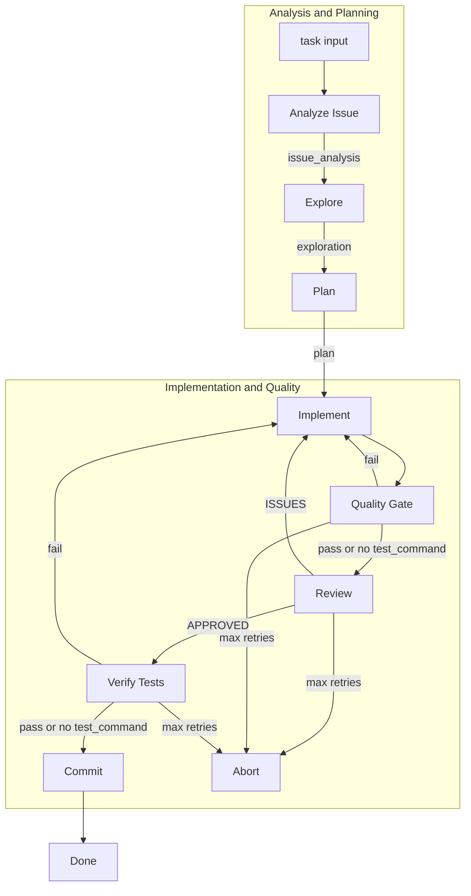

# mycrew

A software development crew powered by [crewAI](https://crewai.com). mycrew runs an event-driven pipeline that explores a codebase, plans changes, implements them, reviews the work, and commits—exclusively for software development tasks.

## Installation

**Requirements:** Python >=3.10, <3.13

1. Install [uv](https://docs.astral.sh/uv/):

```bash
pip install uv
```

2. Clone this repository and install dependencies:

```bash
cd mycrew  # or your project directory
uv sync
```

Or use the crewAI CLI:

```bash
crewai install
```

3. Create a `.env` file in the project root and add your API key:

```
OPENAI_API_KEY=your_key_here
```

## How to Use

Run the pipeline from the project root with `uv run kickoff`. You must provide a task and the target repository path.

**Basic usage:**

```bash
uv run kickoff --task "add a hello world function" --repo-path /path/to/your/repo
```

**All options:**

| Option | Short | Description | Default |
|--------|-------|-------------|---------|
| `--task` | `-t` | Task or issue card description (required) | — |
| `--repo-path` | `-r` | Path to the repository to modify | Current directory |
| `--branch` | `-b` | Git branch for commits | `main` |
| `--retries` | `-n` | Max implement→review retries | `3` |
| `--dry-run` | — | Skip actual git commit; only report what would be committed | `false` |
| `--test-command` | — | Command for quality gate and verification (e.g. pytest, npm test) | — |
| `--issue-id` | — | Issue ID for commit message (e.g. fixes #42) | — |

**Examples:**

```bash
# Dry run: analyze, explore, plan, implement, review, but do not commit
uv run kickoff -t "add user authentication" -r ./my-app --dry-run

# Full run on a specific branch
uv run kickoff -t "fix login bug" -r /Users/me/projects/api -b dev

# With quality gate: run pytest after implement and before commit
uv run kickoff -t "add validation" -r ./backend --test-command "pytest"

# Include issue ID in commit message
uv run kickoff -t "Fix PROJ-123: null pointer" -r ./api --issue-id "PROJ-123"
```

## Pipeline Overview



The flow runs multiple stages with quality gates:

1. **Analyze Issue** — Parses the task/issue card into structured requirements (summary, acceptance criteria, scope)
2. **Explore** — Scans the repository structure, tech stack, and conventions
3. **Plan** — Designs the implementation approach, mapped to acceptance criteria
4. **Implement** — Writes and applies code changes
5. **Quality Gate** — If `--test-command` is set, runs tests; on failure, retries Implement
6. **Review** — Validates the implementation; on rejection, loops back to Implement (up to `--retries`)
7. **Verification** — If `--test-command` is set and review approved, runs tests again; on failure, retries Implement
8. **Commit** — Stages and commits the changes (skipped when `--dry-run` is set)

## Support

- [crewAI documentation](https://docs.crewai.com)
- [crewAI GitHub](https://github.com/joaomdmoura/crewai)
- [crewAI Discord](https://discord.com/invite/X4JWnZnxPb)
