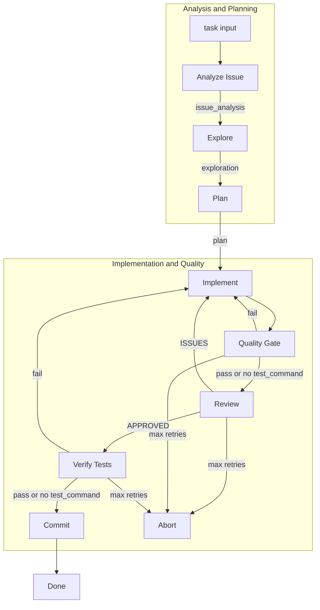

# code_pipeline

A software development crew powered by [crewAI](https://crewai.com). The pipeline explores a codebase, plans changes, implements them, reviews the work, clarifies feedback when needed, and commits—exclusively for software development tasks.

## Project Structure

```
code_pipeline/
├── config.example.yaml       # Template: copy to config.yaml and edit
├── config.yaml               # Run config (task run uses by default)
├── REMOVED # Example project-specific config
├── Dockerfile                # Container image for docker run
├── docker-compose.yml        # docker compose run --rm run
├── Taskfile.yml              # Task runner (task run, task run-script, etc.)
├── pyproject.toml            # Python project config and CLI entry points
├── docs/
│   └── TOOLS_REFERENCE.md    # Tool parameters and example commands
└── src/code_pipeline/
    ├── main.py                # Flow orchestration, kickoff, checkpoint/resume
    ├── llm.py                 # LLM configuration (OpenRouter, OpenAI)
    ├── utils.py               # Shared utilities
    ├── crews/
    │   ├── issue_analyst_crew/ # Analyzes task/issue into structured requirements
    │   ├── explorer_crew/      # Scans repo structure, tech stack, conventions
    │   ├── architect_crew/     # Designs implementation plan
    │   ├── implementer_crew/   # Writes and applies code changes
    │   ├── reviewer_crew/     # Validates implementation
    │   ├── clarify_crew/      # Refines review feedback for implementer
    │   └── commit_crew/       # Stages and commits changes
    └── tools/
        ├── factory.py          # Tool selection per pipeline stage
        ├── repo_shell_tool.py  # Shell commands in repo context
        └── human_tool.py      # Human-in-the-loop feedback
```

Each crew has `config/agents.yaml` and `config/tasks.yaml`. The flow is defined in `main.py` as a crewAI Flow with checkpoint persistence under `.code_pipeline/checkpoint.json` in the target repo.

## Installation

**Requirements:** Python >=3.10, <3.13

1. Install [uv](https://docs.astral.sh/uv/):

```bash
pip install uv
```

2. Clone this repository and install dependencies:

```bash
cd code_pipeline  # or your project directory
uv sync
```

Or use the crewAI CLI:

```bash
crewai install
```

3. Create a `.env` file in the project root and add your API key:

```
# OpenRouter (DeepSeek) - used by default
OPENROUTER_API_KEY=your_key_here

# Or use OpenAI
OPENAI_API_KEY=your_key_here
```

The pipeline uses OpenRouter with DeepSeek R1 by default. Set `OPENROUTER_API_KEY` for OpenRouter models, or `OPENAI_API_KEY` as fallback.

### Optional: GitHub and Documentation Tools

- **GITHUB_TOKEN** — Required for GithubSearchTool (semantic search in GitHub repos). Set in `.env` or environment. Used when `--github-repo` is provided.
- **--github-repo** — GitHub repo in `owner/repo` format. Enables GithubSearchTool for Analyze and Plan stages to find similar implementations and issues.
- **--docs-url** — Documentation URL for CodeDocsSearchTool (e.g. `https://docs.djangoproject.com`). Enables framework-specific doc search in Explore, Plan, and Review.
- **--issue-url** — URL of the issue when the task references a web-based tracker (Jira, Linear, GitHub). Enables ScrapeWebsiteTool in Analyze to fetch full issue content.

### CodeInterpreterTool (Implement stage)

The Implement stage can use CodeInterpreterTool for running Python code snippets when **Docker** is available. If Docker is not installed or not running, the tool is skipped and the pipeline continues with other tools (FileWriterTool, RepoShellTool).

See [docs/TOOLS_REFERENCE.md](docs/TOOLS_REFERENCE.md) for tool parameters and example commands.

## How to Use

- **Option 1: Task** — `task run` (recommended; uses config.yaml by default)
- **Option 2: CLI** — `uv run kickoff -c config.yaml`
- **Option 3: Docker** — `docker run -it --rm -v $(pwd):/workspace -w /workspace -e OPENROUTER_API_KEY=... iklobato/mycrew -c config.yaml`

### Option 1: Task commands (recommended)

If you have [Task](https://taskfile.dev/) installed, use the Taskfile.

**Available tasks:** `task run` | `task run-script` | `task run:from-scratch` | `task run:dry` | `task plot` | `task help`

- **`task run`** — Default: runs from scratch using `config.yaml`. Copy `config.example.yaml` to `config.yaml` and edit. Prints full config before running.
- **`task run-script`** — Pass kickoff flags after `--` (e.g. `task run-script -- -c config.yaml -v -f`)
- **`task run:from-scratch`** — Same as `task run` (from scratch is already the default)
- **`task run:dry`** — Dry run mode (no git commit)
- **`task plot`** — Plot the flow diagram
- **`task help`** — Show kickoff CLI help

Pass parameters via Task vars: `R=`, `V=1`, `TASK_DESC=`, etc.

**Parameters (same semantics as kickoff flags):**

| Param | Maps to | Default |
|-------|---------|---------|
| `CONFIG` | `-c` / `--config` | `config.yaml` (default) |
| `TASK_DESC` | `-t` / `--task` | (from config or required if no CONFIG) |
| `R` | `-r` / `--repo-path` | `.` (or from config) |
| `B` | `-b` / `--branch` | `main` |
| `V` | `-v` / `--verbose` | `0` |
| `F` | `-f` / `--from-scratch` | `1` (default: from scratch) |
| `N` | `-n` / `--retries` | `3` |
| `DRY_RUN` | `--dry-run` | `0` |
| `TEST` | `--test-command` | — |
| `ISSUE_ID` | `--issue-id` | — |
| `GITHUB_REPO` | `--github-repo` | — |
| `ISSUE_URL` | `--issue-url` | — |
| `DOCS` | `--docs-url` | — |

**Task usage examples:**

```bash
# Default: from scratch + config.yaml
# 1. Copy template: cp config.example.yaml config.yaml
# 2. Edit config.yaml with your task, repo_path, etc.
# 3. Run: task run
task run

# Different config file
task run CONFIG=REMOVED

# Override task from config (TASK_DESC overrides config's task)
task run TASK_DESC="add a hello world function"

# With repo and verbose
task run TASK_DESC="fix login bug" R=/path/to/repo V=1

# Repo and branch
task run TASK_DESC="fix bug" R=./my-app B=dev

# Dry run (no git commit)
task run TASK_DESC="add user authentication" DRY_RUN=1
task run:dry TASK_DESC="add user authentication"

# Resume from checkpoint (override default from-scratch)
task run CONFIG=config.yaml F=0

# CLI args style (pass kickoff flags after --)
task run-script -- -c config.yaml -v -f
task run-script -- -t "add feature" -r . --dry-run

# Full example: all params
task run TASK_DESC="add validation logic" \
  R=./my-app \
  B=main \
  N=5 \
  TEST="pytest" \
  ISSUE_ID="fixes #42" \
  GITHUB_REPO="owner/repo" \
  ISSUE_URL="https://github.com/owner/repo/issues/42" \
  DOCS="https://docs.djangoproject.com" \
  V=1
```

### Option 2: Direct CLI

Run the pipeline with `uv run kickoff`. Use `-c config.yaml` to load all params from YAML, or pass `-t` and `-r` explicitly.

**Basic usage:**

```bash
# Config file (recommended)
uv run kickoff -c config.yaml

# Task and repo explicitly
uv run kickoff -t "add a hello world function" -r /path/to/your/repo
```

**All options:**

| Option | Short | Description | Default |
|--------|-------|-------------|---------|
| `--task` | `-t` | Task or issue card description (required) | — |
| `--repo-path` | `-r` | Path to the repository to modify | Current directory |
| `--branch` | `-b` | Git branch for commits | `main` |
| `--from-scratch` | `-f` | Ignore checkpoint and run from the beginning | `false` |
| `--retries` | `-n` | Max implement→review retries | `3` |
| `--dry-run` | — | Skip actual git commit; only report what would be committed | `false` |
| `--test-command` | — | Command for quality gate and verification (e.g. pytest, npm test) | — |
| `--issue-id` | — | Issue ID for commit message (e.g. fixes #42) | — |
| `--github-repo` | — | GitHub repo (owner/repo) for GithubSearchTool; requires GITHUB_TOKEN | — |
| `--issue-url` | — | URL of the issue for ScrapeWebsiteTool (e.g. GitHub, Jira) | — |
| `--docs-url` | — | Documentation URL for CodeDocsSearchTool (e.g. https://docs.djangoproject.com) | — |
| `--config` | `-c` | Path to YAML config file (all params; CLI overrides) | — |

**CLI examples:**

```bash
# Config file (copy config.example.yaml to config.yaml and edit)
uv run kickoff -c config.yaml

# From scratch + verbose
uv run kickoff -c config.yaml -f -v

# Dry run
uv run kickoff -t "add user authentication" -r ./my-app --dry-run

# From scratch (ignore checkpoint)
uv run kickoff -t "add feature" -r ./my-app -f

# Full run with all optional params
uv run kickoff \
  -t "add validation logic" \
  -r ./my-app \
  -b main \
  -n 5 \
  --test-command "pytest" \
  --issue-id "fixes #42" \
  --github-repo "owner/repo" \
  --issue-url "https://github.com/owner/repo/issues/42" \
  --docs-url "https://docs.djangoproject.com"
```

### Option 3: Docker

Run the pipeline in a container. Requires Docker and API keys.

**Build (optional, if using pre-built image):**

```bash
docker build -t iklobato/mycrew .
```

**Basic run:**

```bash
docker run -it --rm \
  -v $(pwd):/workspace \
  -w /workspace \
  -e OPENROUTER_API_KEY=$OPENROUTER_API_KEY \
  iklobato/mycrew -c config.yaml
```

**Config requirements:** `repo_path` in config must be valid inside the container. Use `"."` (relative to `/workspace`) or `/workspace` or `/workspace/subdir`. Host paths like `/Users/you/...` will not work.

**Optional env vars:**
- `-e GITHUB_TOKEN=$GITHUB_TOKEN` — For GithubSearchTool when `--github-repo` is in config
- `-e OPENAI_API_KEY=$OPENAI_API_KEY` — Alternative to OpenRouter

**Optional:** If `.env` is in your workspace, it is included via the volume mount and will be loaded from `/workspace/.env`.

**Docker Compose:** For a simpler run with built-in mounts and env:

```bash
docker compose run --rm run
```

**Note:** CodeInterpreterTool requires Docker and is skipped when running inside a container.

## Pipeline Overview



The flow runs multiple stages with quality gates:

1. **Analyze Issue** — Parses the task/issue card into structured requirements (summary, acceptance criteria, scope)
2. **Explore** — Scans the repository structure, tech stack, and conventions
3. **Plan** — Designs the implementation approach, mapped to acceptance criteria
4. **Implement** — Writes and applies code changes
5. **Quality Gate** — If `--test-command` is set, runs tests; on failure, retries Implement
6. **Review** — Validates the implementation; on rejection, runs Clarify to refine feedback, then loops back to Implement (up to `--retries`)
7. **Verification** — If `--test-command` is set and review approved, runs tests again; on failure, retries Implement
8. **Commit** — Stages and commits the changes (skipped when `--dry-run` is set)

## Support

- [crewAI documentation](https://docs.crewai.com)
- [crewAI GitHub](https://github.com/joaomdmoura/crewai)
- [crewAI Discord](https://discord.com/invite/X4JWnZnxPb)
