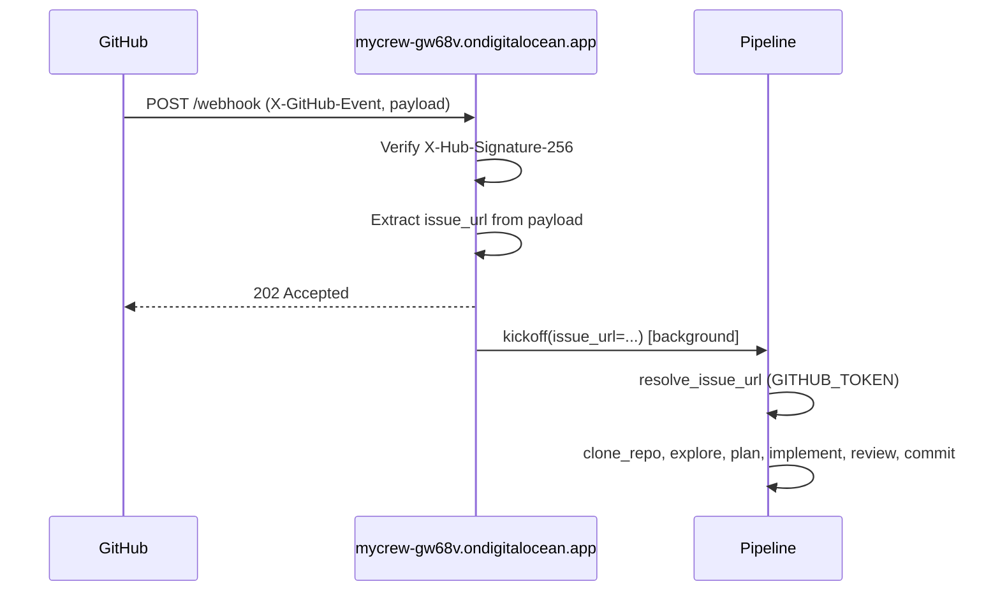

# GitHub Webhook Registration Guide

This guide explains how to register the code pipeline webhook with GitHub to receive **issue assignments** and **pull request code review comments**, and how to configure it for your host `https://mycrew-gw68v.ondigitalocean.app/`.

---

## Webhook URL

**Payload URL to register:**

```
https://mycrew-gw68v.ondigitalocean.app/webhook
```

The webhook endpoint accepts `POST` requests. GitHub sends the event type in the `X-GitHub-Event` header.

---

## Supported Events

| Event | Action | Payload path | Pipeline trigger |
|-------|--------|--------------|------------------|
| `issues` | `assigned` | `issue.html_url` | Runs pipeline for the assigned issue |
| `pull_request_review_comment` | `created` | `pull_request.html_url` | Runs pipeline for the PR (review comment context) |

Unsupported event/action combinations return `200 OK` with `{"status": "ignored", "reason": "..."}`. The `ping` event (sent when you add a webhook) is ignored and returns 200.

---

## Registration Options

### Option D: One-shot configure (GitHub + DigitalOcean)

Run both GitHub webhook registration and DigitalOcean App Platform env sync:

```bash
export GITHUB_TOKEN=ghp_xxxx
export GITHUB_WEBHOOK_SECRET=your_secret   # Must match value on remote
export DO_TOKEN=your_digitalocean_token

task configure:webhook
# Or: python scripts/configure_webhook_remote.py
```

This registers the webhook at GitHub for `iklobato/mycrew` and syncs `GITHUB_TOKEN`, `GITHUB_WEBHOOK_SECRET`, and `OPENROUTER_API_KEY` to the DO app. Use `--github-only` or `--do-only` to run one part.

---

### Option E: Register via API (GitHub only)

If `GITHUB_WEBHOOK_SECRET` is already set on your remote server, use the `register_webhook` script to configure GitHub via the API. Your `GITHUB_TOKEN` must have `admin:repo_hook` scope (classic PAT) or **Webhooks: Read and write** (fine-grained PAT).

```bash
# Set env vars (or use config)
export GITHUB_TOKEN=ghp_xxxx
export GITHUB_WEBHOOK_SECRET=your_secret  # Must match the value on your remote server

# Register webhook for a repository
uv run register_webhook owner/repo

# Override URL if needed
uv run register_webhook owner/repo --url https://mycrew-gw68v.ondigitalocean.app/webhook
```

If a webhook to the same URL already exists, it is updated. Otherwise a new one is created.

---

### Option A: Repository Webhook (single repo) — manual

1. Go to your repository on GitHub.
2. **Settings** → **Webhooks** → **Add webhook**
3. Configure:
   - **Payload URL:** `https://mycrew-gw68v.ondigitalocean.app/webhook`
   - **Content type:** `application/json`
   - **Secret:** Generate a random string (e.g. `openssl rand -hex 32`) and save it for `GITHUB_WEBHOOK_SECRET`
   - **Which events:** "Let me select individual events"
     - Check **Issues**
     - Check **Pull request review comments**
4. **Add webhook**

### Option B: Organization Webhook (all repos in org)

1. Go to **Organization** → **Settings** → **Webhooks** → **Add webhook**
2. Same configuration as Option A.
3. Choose which repositories can trigger the webhook (all or specific repos).

### Option C: GitHub App (recommended for multi-repo)

1. **Settings** → **Developer settings** → **GitHub Apps** → **New GitHub App**
2. **Webhook:**
   - **Active:** checked
   - **Webhook URL:** `https://mycrew-gw68v.ondigitalocean.app/webhook`
   - **Webhook secret:** Generate and save for `GITHUB_WEBHOOK_SECRET`
   - **Subscribe to events:** Issues, Pull request review comments
3. **Permissions & events:**
   - Repository permissions:
     - **Issues:** Read and write
     - **Pull requests:** Read and write
     - **Contents:** Read and write (for clone/push)
     - **Metadata:** Read-only (required)
4. Install the app on the desired repositories/org.

---

## Environment Variables

### Required for webhook verification

| Variable | Description |
|----------|-------------|
| `GITHUB_WEBHOOK_SECRET` | Secret configured in the webhook. Used to verify `X-Hub-Signature-256`. If empty, signature verification is skipped (not recommended for production). |

### Required for pipeline execution (after webhook triggers)

| Variable | Description |
|----------|-------------|
| `GITHUB_TOKEN` | Personal access token or GitHub App installation token. Used to fetch issue content, clone repos, create PRs. |

### GITHUB_TOKEN permissions/scopes

For the pipeline to work when triggered by the webhook:

| Scope | Purpose |
|-------|---------|
| `repo` | Clone repositories, fetch issue/PR data, push branches, create pull requests |
| `read:org` | (Optional) Read org metadata if needed |

**Creating a fine-grained PAT (recommended):**

1. **Settings** → **Developer settings** → **Personal access tokens** → **Fine-grained tokens** → **Generate new token**
2. Repository access: "Only select repositories" or "All repositories"
3. Permissions:
   - **Contents:** Read and write
   - **Issues:** Read and write
   - **Pull requests:** Read and write
   - **Metadata:** Read-only (required)

**Classic PAT (alternative):**

- Scopes: `repo`, `read:org`

---

## Server configuration (DigitalOcean App Platform)

Ensure your app:

1. **Exposes port 8000** (or the port set by `PORT`)
2. **Uses HTTPS** — DigitalOcean App Platform provides this by default
3. **Has these env vars set:**
   - `GITHUB_TOKEN`
   - `GITHUB_WEBHOOK_SECRET` (same value as in the GitHub webhook)
   - `OPENROUTER_API_KEY` (for LLM calls)

### Health check

Verify the webhook server is reachable:

```bash
curl https://mycrew-gw68v.ondigitalocean.app/health
```

Expected: `{"status":"healthy"}`

---

## Testing

### 1. Manual trigger (no GitHub event)

```bash
curl -X POST https://mycrew-gw68v.ondigitalocean.app/webhook \
  -H "Content-Type: application/json" \
  -d '{"issue_url": "https://github.com/owner/repo/issues/123"}'
```

Expected: `202 Accepted` with `{"status":"accepted","issue_url":"...","message":"Pipeline queued"}`

### 2. Simulate GitHub webhook (with signature)

```bash
# Generate secret: SECRET=$(openssl rand -hex 32)
# Set GITHUB_WEBHOOK_SECRET=$SECRET in your app

# For issues.assigned, payload structure:
PAYLOAD='{"action":"assigned","issue":{"html_url":"https://github.com/owner/repo/issues/123"}}'
SIG=$(echo -n "$PAYLOAD" | openssl dgst -sha256 -hmac "$SECRET" | awk '{print "sha256="$2}')

curl -X POST https://mycrew-gw68v.ondigitalocean.app/webhook \
  -H "Content-Type: application/json" \
  -H "X-GitHub-Event: issues" \
  -H "X-Hub-Signature-256: $SIG" \
  -d "$PAYLOAD"
```

### 3. GitHub ping (after adding webhook)

After adding the webhook, GitHub sends a `ping` event. Your server should return `200 OK`. The pipeline will not run for ping (event is ignored).

---

## Flow diagram



---

## Troubleshooting

| Problem | Check |
|---------|-------|
| 403 Invalid signature | `GITHUB_WEBHOOK_SECRET` matches the value in GitHub webhook settings |
| 400 Missing or empty issue URL | Payload structure matches expected path (`issue.html_url` or `pull_request.html_url`) |
| Pipeline fails after 202 | Check `GITHUB_TOKEN` is set and has `repo` scope; check OpenRouter API key |
| Webhook shows red X in GitHub | Server returned non-2xx or took too long (>10s). Check logs. |
